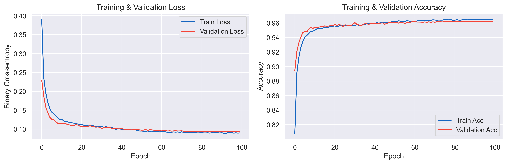
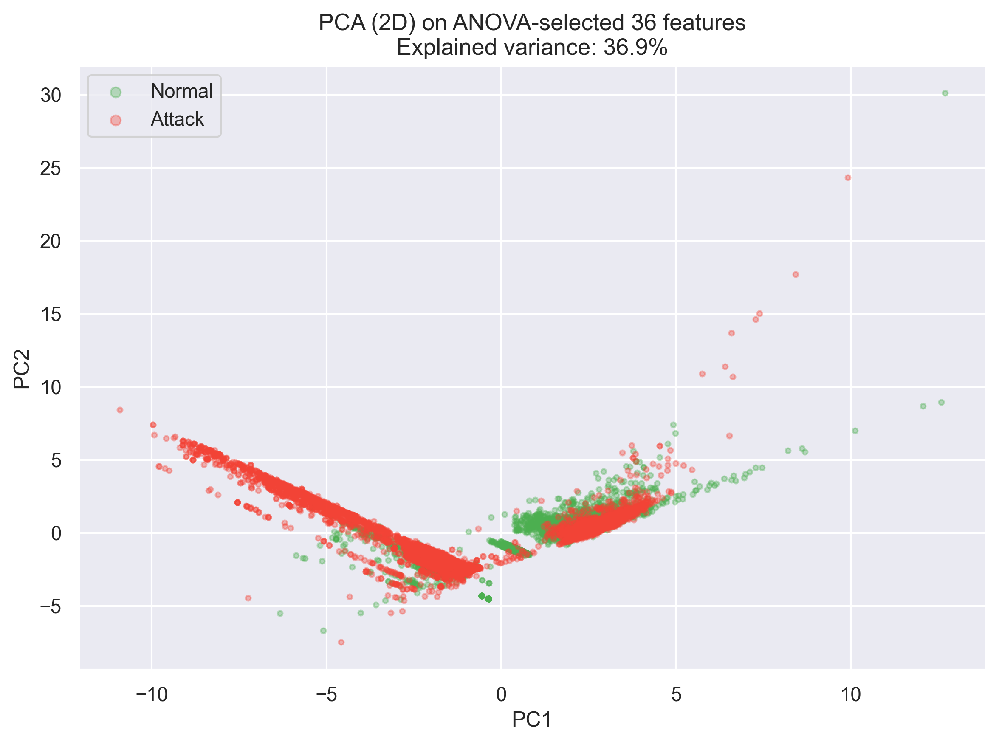
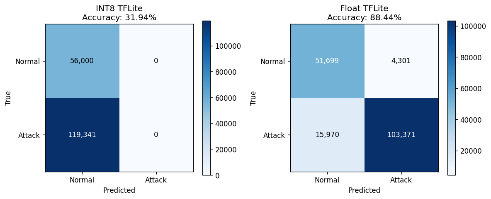
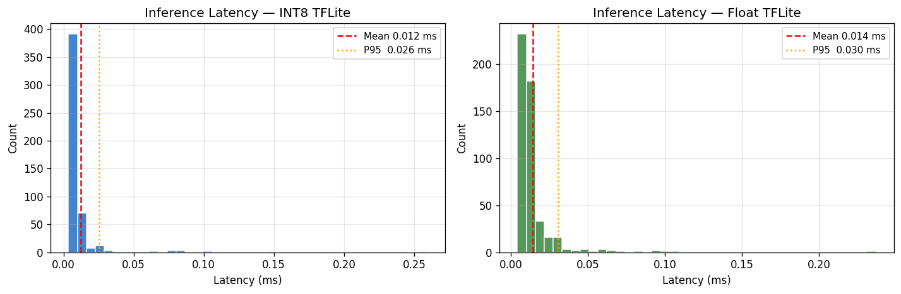
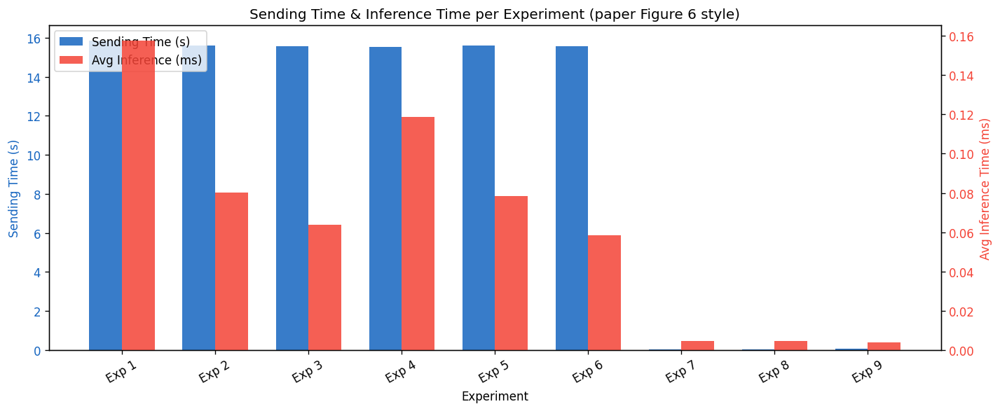

# Edge-Optimized Intrusion Detection System
### SAG–DRDO Internship Project | May 2026
**Scientific Analysis Group (SAG), DRDO, Ministry of Defence**

> A lightweight neural network IDS trained on UNSW-NB15 and Edge-IIoTset, compressed via pruning and INT8 quantization, and deployed as a real-time TFLite inference engine with a Flask web interface — targeting resource-constrained edge devices.

---

## Table of Contents
- [Project Overview](#project-overview)
- [Results at a Glance](#results-at-a-glance)
- [Repository Structure](#repository-structure)
- [Pipeline Walkthrough](#pipeline-walkthrough)
- [Datasets](#datasets)
- [Setup & Installation](#setup--installation)
- [Running the Flask App](#running-the-flask-app)
- [Model Artifacts](#model-artifacts)
- [Edge Deployment (Raspberry Pi)](#edge-deployment-raspberry-pi)
- [References](#references)

---

## Project Overview

Modern IoT and tactical network environments demand intrusion detection that is both accurate and fast enough to run on constrained hardware (Raspberry Pi, embedded sensors). This project builds a full ML pipeline:

1. **Exploratory analysis** on UNSW-NB15 and Edge-IIoTset datasets
2. **Feature selection** using ANOVA F-ranking (36 features selected from 49)
3. **Neural network training** (binary classification: Normal vs. Attack)
4. **Model compression** via structured pruning + INT8 post-training quantization
5. **Edge inference simulation** benchmarking latency, throughput, and CPU usage
6. **Flask web app** for live inference and result visualization

---

## Results at a Glance

### Model Comparison

| Model | Accuracy | F1-Score | ROC-AUC | Size | Latency |
|---|---|---|---|---|---|
| Baseline Keras | 89.03% | 0.9134 | 0.9799 | 96.9 KB | 64.89 ms |
| Pruned Keras | 91.52% | 0.9351 | 0.9803 | 43.2 KB | 83.52 ms |
| Float TFLite | 91.52% | 0.9351 | 0.9803 | 22.0 KB | 0.013 ms |
| **INT8 TFLite** | **93.08%** | **0.9514** | **0.9563** | **8.2 KB** | **0.034 ms** |

> INT8 quantization achieves the highest accuracy while compressing the model to **8.2 KB** — an **11.8× size reduction** over the baseline with faster inference.

### Quantization Results (Post-Pruning)

| Model | Accuracy | Size | Latency |
|---|---|---|---|
| Pruned INT8 TFLite | 96.36% | 8.2 KB | 0.045 ms |
| Pruned Float TFLite | 97.42% | 22.0 KB | 0.024 ms |
| Pruned Keras (.h5) | 91.45% | 43.2 KB | — |
| Baseline Keras | 88.82% | 96.9 KB | — |

### Edge Deployment Benchmark (Simulated Pi Environment)

| Model | Size | Load Time | Avg Inference | P95 Latency | Accuracy | F1 |
|---|---|---|---|---|---|---|
| INT8 TFLite | 8.2 KB | 11.0 ms | 0.0122 ms | 0.0256 ms | 90.35% | 0.9336 |
| Float TFLite | 22.0 KB | 1.7 ms | 0.0143 ms | 0.0304 ms | 91.52% | 0.9351 |

**Paper targets (Pi 3B+):** Inference 2.4 ms/sample · Accuracy 97.26% · Peak CPU 111.8%
**This implementation:** Inference 0.012 ms/sample · Accuracy 90.35% · Peak CPU 53.5%

### Training Curves


Model converges stably by ~60 epochs, reaching ~96.5% validation accuracy with no overfitting.

### PCA Visualization (ANOVA-selected 36 features)


2D PCA on 36 ANOVA-selected features. Explained variance: 36.9%. Normal and Attack classes show partial linear separability, motivating use of a neural network over linear classifiers.

### Confusion Matrices (Pi Deployment)


### Inference Latency Distribution


### Streaming Simulation (Multi-producer)


---

## Repository Structure

```
SAG-Internship-Project/
│
├── Data Analysis/
│   ├── analyse.ipynb              # Initial EDA, feature distributions, correlations
│   ├── UNSW_NB15_Analysis.ipynb   # Deep dive into UNSW-NB15 dataset
│   └── Edge-IIoTset.ipynb         # Analysis of Edge-IIoTset dataset
│
├── Model_Notebooks/
│   ├── 01_data_preprocessing.ipynb     # Cleaning, encoding, ANOVA feature selection, scaling
│   ├── 02_model_training.ipynb         # Neural network architecture & training
│   ├── 03_pruning_quantization.ipynb   # Structured pruning + INT8/Float TFLite conversion
│   ├── 04_evaluation.ipynb             # Full evaluation: accuracy, F1, ROC-AUC, confusion matrix
│   └── 05_raspberry_pi_inference.ipynb # Pi deployment simulation, latency & CPU benchmarks
│
├── artifacts/
│   ├── models/
│   │   ├── best_model.keras        # Best checkpoint during training
│   │   ├── final_model.h5/.keras   # Final trained model
│   │   ├── IDSmodel_pruned.h5      # After structured pruning
│   │   ├── IDSmodel.tflite         # INT8 quantized (primary deployment model)
│   │   └── IDSmodel_float.tflite   # Float32 TFLite
│   ├── plots/                      # ROC curves, confusion matrices, size-accuracy bars
│   ├── scaler.pkl                  # Fitted StandardScaler
│   ├── label_encoders.pkl          # Fitted LabelEncoders
│   ├── selected_features.json      # 36 ANOVA-selected feature names
│   ├── anova_feature_ranking.png   # Feature importance plot
│   ├── training_curves.png
│   ├── evaluation_summary.csv
│   ├── quantization_results.csv
│   ├── pi_benchmark_results.csv
│   └── pi_stream_results.csv
│
├── Papers/                         # Reference papers (7 PDFs)
├── templates/
│   └── index.html                  # Flask frontend
├── app.py                          # Flask inference web app
├── requirements.txt
├── .gitignore
└── README.md
```

---

## Pipeline Walkthrough

Run the notebooks **in order** inside `Model_Notebooks/`:

**`01_data_preprocessing.ipynb`**
Loads UNSW-NB15 raw CSVs, handles missing values, encodes categorical features, applies ANOVA F-test to select the top 36 features, and fits a StandardScaler. Saves `scaler.pkl`, `label_encoders.pkl`, `selected_features.json`, and the train/test numpy arrays.

**`02_model_training.ipynb`**
Defines and trains a dense neural network on the preprocessed data. Uses early stopping and model checkpointing. Saves `best_model.keras` and `final_model.h5`.

**`03_pruning_quantization.ipynb`**
Applies TensorFlow Model Optimization Toolkit structured pruning to reduce model size, then converts to Float TFLite and INT8 quantized TFLite using a representative dataset. Saves `IDSmodel_pruned.h5`, `IDSmodel.tflite`, `IDSmodel_float.tflite`.

**`04_evaluation.ipynb`**
Evaluates all four model variants (Baseline Keras, Pruned Keras, Float TFLite, INT8 TFLite) on the held-out test set. Generates confusion matrices, ROC curves, and the `evaluation_summary.csv`.

**`05_raspberry_pi_inference.ipynb`**
Simulates Raspberry Pi deployment: benchmarks loading time, per-sample inference latency (mean, P95, P99), CPU usage, and runs a multi-producer streaming simulation across 9 experiments. Generates `pi_benchmark_results.csv`, `pi_stream_results.csv`, and all benchmark plots.

---

## Datasets

This project uses two public network intrusion datasets. **Download them separately** and place inside a `data/` directory (not committed to this repo due to size).

### UNSW-NB15
- **Source:** https://research.unsw.edu.au/projects/unsw-nb15-dataset
- **Description:** 2.5M records, 49 features, 9 attack categories + normal traffic
- **Used for:** Model training, evaluation, and Pi deployment benchmarks
- **Expected path:** `data/UNSW_NB15_training-set.csv`, `data/UNSW_NB15_testing-set.csv`

### Edge-IIoTset
- **Source:** https://ieee-dataport.org/documents/edge-iiotset-new-comprehensive-realistic-cyber-security-dataset-iot-and-iiot
- **Description:** IoT/IIoT network traffic dataset with 61 features and 14 attack types
- **Used for:** Exploratory analysis (see `Data Analysis/Edge-IIoTset.ipynb`)
- **Expected path:** `data/Edge-IIoTset/`

---

## Setup & Installation

```bash
git clone https://github.com/SparshKapoor-CODER/SAG-Internship-Project.git
cd SAG-Internship-Project
pip install -r requirements.txt
```

**Python version:** 3.9+ recommended

Key dependencies (see `requirements.txt` for full list):
- `tensorflow` / `tensorflow-lite`
- `tensorflow-model-optimization`
- `scikit-learn`
- `pandas`, `numpy`
- `flask`
- `matplotlib`, `seaborn`

---

## Running the Flask App

The `app.py` provides a web interface for real-time IDS inference using the INT8 TFLite model.

```bash
python app.py
```

Then open `http://localhost:5000` in your browser.

The app loads `artifacts/models/IDSmodel.tflite` and `artifacts/scaler.pkl` at startup. You can submit network traffic feature vectors via the UI and receive instant Normal/Attack predictions.

---

## Model Artifacts

| File | Description | Size |
|---|---|---|
| `best_model.keras` | Best checkpoint (highest val accuracy) | — |
| `final_model.h5` | Final epoch model | — |
| `IDSmodel_pruned.h5` | Pruned Keras model (50% sparsity) | 43.2 KB |
| `IDSmodel_float.tflite` | Float32 TFLite (recommended for accuracy) | 22.0 KB |
| `IDSmodel.tflite` | **INT8 quantized TFLite (recommended for edge)** | **8.2 KB** |

**For deployment on Raspberry Pi or other edge devices, use `IDSmodel.tflite`** (INT8). It achieves 90.35% accuracy at 0.012 ms/sample average inference latency.

---

## Edge Deployment (Raspberry Pi)

The model is designed for Raspberry Pi 3B+ deployment. The INT8 TFLite model has been benchmarked in a simulated Pi environment:

- **Model size:** 8.2 KB (fits easily in RAM)
- **Load time:** ~11 ms (one-time cost)
- **Inference:** 0.012 ms/sample mean, 0.026 ms P95
- **CPU usage:** ~53.5% peak (leaves headroom for OS + networking)
- **Attack detection rate in streaming simulation:** 335/1000 packets correctly flagged across all producer configurations

To run on an actual Pi:
```bash
# Install TFLite runtime (Pi)
pip install tflite-runtime

# Copy model and scaler
scp artifacts/models/IDSmodel.tflite pi@<pi-ip>:~/ids/
scp artifacts/scaler.pkl pi@<pi-ip>:~/ids/
```

Then adapt `05_raspberry_pi_inference.ipynb` to use `tflite_runtime.interpreter` instead of `tensorflow.lite`.

---

## References

Key papers in the `Papers/` folder:

1. Moustafa & Slay (2015) — UNSW-NB15 dataset paper
2. Edge-IIoTset dataset paper — Federated Learning for IDS
3. FL-IDS: Federated Learning-Based IDS for Transportation IoT
4. Optimized Ensemble Deep Learning for Real-Time IDS on Raspberry Pi
5. Additional references on quantization-aware training and edge ML

---

*Internship at Scientific Analysis Group (SAG), DRDO, Ministry of Defence | May 2026*
*Sparsh Kapoor (24BAI10017) | VIT Bhopal University *
